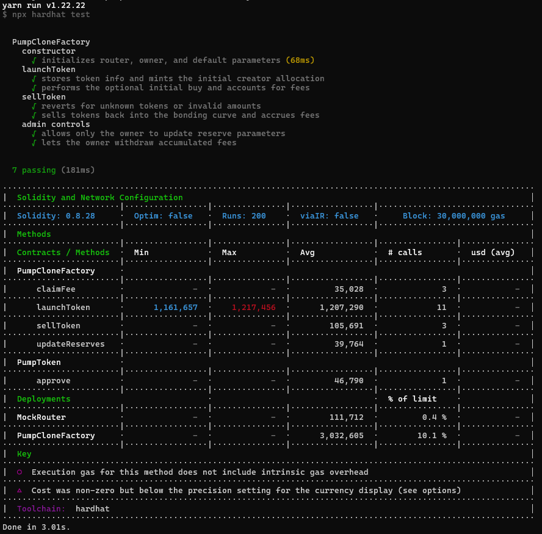

# 💊 NadFun Monad Smart Contract

The **Nad.fun Monad Smart Contract** brings the power of viral, one-click token creation to the **EVM-Compatible blockchain**, mirroring the simplicity and virality of the original **Nad.fun** on Solana. This version is built natively for **Monad's EVM-compatible testnet**, with full support for **Uniswap liquidity migration**, enabling instant tradability in the broader Ethereum ecosystem.

## ✨ Key Features

- **Token Creation**: Instantly create customizable tokens (name, symbol, total supply) on Monad.

- **Bonding Curve Pricing**: Implements a linear bonding curve for fair price discovery, rewarding early buyers.

- **Auto Liquidity Management**: Seamlessly manage buys/sells using an embedded bonding curve—no AMM setup required.

- **Uniswap Migration**: Once the liquidity threshold is hit, migrate liquidity to **Uniswap V2/V3** for open DeFi trading.

- **Full Onchain Execution**: All logic is executed onchain—including minting, pricing, and migration—for maximum transparency and decentralization.

- **EVM-Compatible**: Written in **Solidity**, deployed on Monad, and fully interoperable with Ethereum tooling like **Hardhat**, **Foundry**, and **MetaMask**.

- 🚀 **Uniswap Liquidity Migration** 🚀: After sufficient buy-in volume is reached, token liquidity is automatically migrated to a Uniswap pool—allowing users to continue trading in the open market with real-time pricing and increased exposure.

- 🚀 **Token Authority Options** 🚀: Smart contract logic supports optional authority revocation or time-bound admin permissions, ensuring flexibility in launch strategy (community-led or project-driven).

## 🔄 Contract Flow Overview

1. **Token Launch**
   - A creator calls `launchToken` with the desired name and symbol.
   - The factory deploys a dedicated `NadToken`, mints an initial supply to the creator, and seeds the bonding curve with predefined virtual reserves.
   - Any ETH sent alongside the launch call executes the first buy: the factory takes the protocol fee, updates the bonding-curve reserves, and mints the appropriate token amount back to the creator.

2. **Secondary Buys (External Integrations)**
   - Frontends or scripts can continue calling `launchToken` with additional ETH (same token address) to simulate buys until liquidity migration occurs.
   - Each buy applies the bonding-curve formula `_calculateReserveAfterBuy`, deducts the fee, and sends newly minted tokens to the buyer.

3. **Selling Back to the Curve**
   - Holders call `sellToken(tokenAddress, amount)` before liquidity migration.
   - The factory computes the ETH out based on the updated reserves, with a fee routed to `accumulatedFees`.
   - Tokens are pulled via `transferFrom`, reserves are updated, and the seller receives ETH directly from the contract balance.

4. **Admin Controls**
   - `updateReserves`, `updateFeeRate`, and `updateLiquidityMigrationFee` let the owner tweak global defaults for future launches.
   - `claimFee` withdraws all accumulated protocol fees to a specified address.

5. **Liquidity Migration (Future Expansion)**
   - Parameters such as `liquidityMigrationFee`, the stored Uniswap router address, and the WETH handle are prepared for the migration feature.
   - A future release can integrate the `LiquiditySwapped` event to track the actual migration into Uniswap V2 once thresholds are met.
   
## 🧪 Unit Test Result

## 📞 Contact Info

### Telegram: [enlomy](https://t.me/enlomy)

## 🍵 Tip

### If you are interested in my projects, please [🔗fork](https://github.com/xbuilders7/nadfun-smart-contract/fork) or give me ⭐star
